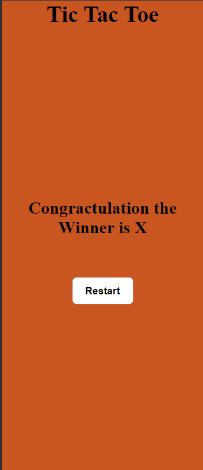

# Tic Tac Toe - Interactive Game

Tic Tac Toe is a two-player game implemented using **HTML**, **CSS**, and **JavaScript**. It provides an engaging and intuitive interface for players to compete in marking cells on a 3x3 grid, checking for winning conditions in real-time.

## Table of Contents
- [Preview](#preview)
- [Features](#features)
- [Technologies Used](#technologies-used)
- [Usage](#usage)
- [Deployment](#deployment)
- [Contact](#contact)
- [Acknowledgments](#acknowledgments)

---

## Preview

#### 1.

#### 2.

#### 3.

---

## Features

### Core Functionality:
- **Two-Player Gameplay**: Alternate turns for Player X and Player O.
- **Dynamic Winning Check**: Automatically checks for row, column, or diagonal wins.
- **Draw Detection**: Declares a draw when all cells are filled with no winner.
- **Restart Option**: Reset the game at any time for a new match.

### Design:
- **Responsive Layout**: Built using **Flexbox** to adapt to various screen sizes.
- **Visual Feedback**: Highlights the winning combination for clarity.
- **Interactive UI**: Button-based grid design for intuitive interaction.

---

## Technologies Used
- **HTML**: Structure of the game grid and interface elements.
- **CSS**: Styling, including Flexbox for layout and animations for transitions.
- **JavaScript**: Game logic, turn handling, and dynamic updates.

---

## Usage

### Playing the Game:
1. **Access the Game**:
   - Open the deployed website or run the game locally in a browser.

2. **Take Turns**:
   - Player X starts the game. Click on any available cell to mark it.
   - Player O's turn follows automatically.

3. **Win or Draw**:
   - The game detects and displays the winner or announces a draw if all cells are filled.

4. **Restart**:
   - Click the "Restart" button to play a new match.

---

## Deployment
The project is deployed and accessible at https://rohanbhoge.github.io/tictactoe/.

---

## Contact

Feel free to reach out to me through the following channels:

- **Email**: bhogerohan12@gmail.com
- **GitHub**: https://github.com/RohanBhoge
- **LinkedIn**: https://www.linkedin.com/in/rohanbhoge/

---

## Acknowledgments
- Thanks to the **open-source community** for resources and guidance.
- Special appreciation for the simplicity and versatility of **Flexbox** in modern web design.
